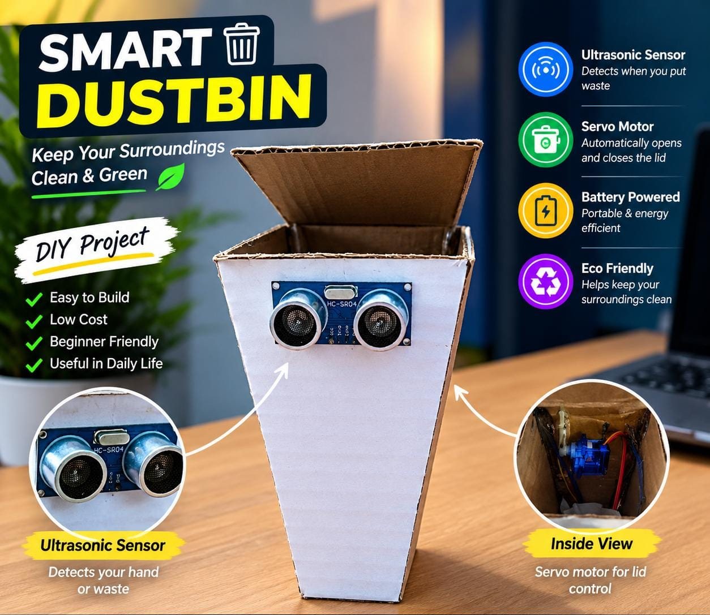

<div align="center">

# Smart Dustbin

**A contactless bin that opens its own lid.**
Wave a hand, the lid lifts, holds for five seconds, and closes by itself.

[](https://github.com/USERNAME/Smart-Dustbin/actions/workflows/build.yml)
[](LICENSE)
[](https://www.arduino.cc/)
[](components/COMPONENT_LIST.md)
[](CONTRIBUTING.md)



[Demo](video/demo-link.md) · [How it works](docs/WORKING.md) · [Wiring](docs/CONNECTION_DIAGRAM.md) · [Full write-up](docs/PROJECT_DOCUMENTATION.md) · [Contributing](CONTRIBUTING.md)

</div>

---

## Why

Touching the lid is the least hygienic part of throwing something away. This removes that step entirely with about ₹700 of parts and under seventy lines of code.

## How it works

An HC-SR04 ultrasonic sensor on the front of the bin measures the distance to whatever is in front of it, roughly five times a second. When that distance drops to 20 cm or less, the Arduino drives an SG90 servo from 0° to 90° and the lid lifts. After five seconds the servo returns to 0°, then the sketch waits two more seconds before it starts watching again.

```
   Hand  ──►  HC-SR04  ──►  Arduino Uno  ──►  SG90 Servo  ──►  Lid
            (sense)         (decide)          (actuate)
```

A timeout on `pulseIn()` returns `-1` when no echo comes back, which is what stops the lid flapping at an empty room. That detail, and the rest of the sketch line by line, is in [docs/WORKING.md](docs/WORKING.md).

## Specifications

| | |
|---|---|
| Detection range | 20 cm (configurable, sensor is good to 400 cm) |
| Sampling rate | ~5 Hz |
| Lid open duration | 5 s |
| Cooldown | 2 s |
| Full cycle | ~7.2 s |
| Idle current | ~20 mA |
| Peak current | ~150 mA during servo travel |
| Supply | 5V USB or 9V battery via the barrel jack |
| Dependencies | `Servo` (bundled with the Arduino IDE) |

## Hardware

| Component | Qty |
|---|---|
| Arduino Uno R3 | 1 |
| HC-SR04 ultrasonic sensor | 1 |
| SG90 micro servo | 1 |
| Plastic dustbin with a hinged lid | 1 |
| Jumper wires, 9V battery or USB power | — |

Full list with specs, prices and substitutions: [components/COMPONENT_LIST.md](components/COMPONENT_LIST.md).

## Wiring

| Arduino pin | Connects to |
|---|---|
| `D9` | HC-SR04 `TRIG` |
| `D10` | HC-SR04 `ECHO` |
| `D6` | Servo signal (orange) |
| `5V` | HC-SR04 `VCC`, servo `VCC` (red) |
| `GND` | HC-SR04 `GND`, servo `GND` (brown) |

> [!WARNING]
> A 9V battery goes to the barrel jack or `VIN`, never to the `5V` pin. If the board resets when the servo moves, give the servo its own 5V supply and tie its ground to the Arduino's.

Diagram and assembly notes: [docs/CONNECTION_DIAGRAM.md](docs/CONNECTION_DIAGRAM.md).

## Getting started

### Arduino IDE

1. Install the [Arduino IDE](https://www.arduino.cc/en/software).
2. Wire the circuit as above.
3. Open `firmware/Smart_Dustbin/Smart_Dustbin.ino`.
4. Select **Tools → Board → Arduino Uno**, then the right port.
5. Upload, and open the Serial Monitor at **9600 baud** to watch live distance readings.

### arduino-cli

```bash
arduino-cli core install arduino:avr
arduino-cli lib install Servo
arduino-cli compile --fqbn arduino:avr:uno firmware/Smart_Dustbin
arduino-cli upload  --fqbn arduino:avr:uno -p /dev/ttyACM0 firmware/Smart_Dustbin
arduino-cli monitor -p /dev/ttyACM0 -c baudrate=9600
```

## Tuning

The constants at the top of the sketch are the ones worth changing:

```cpp
const int openAngle      = 90;  // how far the lid swings open
const int closeAngle     = 0;   // resting position
const int detectDistance = 20;  // trigger range in cm
```

If the lid does not close fully, adjust `closeAngle` a few degrees at a time rather than forcing the servo horn.

## Repository layout

```
Smart-Dustbin/
├── .github/
│   ├── ISSUE_TEMPLATE/     Bug and feature issue forms
│   ├── workflows/          CI: compile, lint, link check
│   └── PULL_REQUEST_TEMPLATE.md
├── firmware/
│   └── Smart_Dustbin/      Arduino sketch (folder name must match the .ino)
├── hardware/
│   ├── circuit-diagram/    Schematic exports
│   └── wiring/             Wiring photos and diagrams
├── components/             Bill of materials and specifications
├── docs/                   Working principle, wiring, full write-up
├── images/                 Build photos
└── video/                  Demo link and timestamps
```

## Roadmap

- [ ] Replace blocking `delay()` with `millis()` timing so the bin stays responsive
- [ ] Second ultrasonic sensor inside the bin for fill-level detection
- [ ] LED or buzzer when the bin is full
- [ ] ESP8266 / ESP32 variant reporting fill level over Wi-Fi
- [ ] Solar panel and rechargeable cell for outdoor use

## Known limitations

The sensor cannot tell a hand from a wall, so anything parked within 20 cm holds the bin in a repeating cycle. Soft or angled surfaces scatter the burst and read as `No Echo`. The blocking delays mean the bin ignores a second person for the seven seconds after a trigger. Details in [docs/WORKING.md](docs/WORKING.md#known-limitations).

## Contributing

Issues and pull requests are welcome. Anything touching the sketch needs to be tested on real hardware first — see [CONTRIBUTING.md](CONTRIBUTING.md).

## License

MIT — see [LICENSE](LICENSE).
