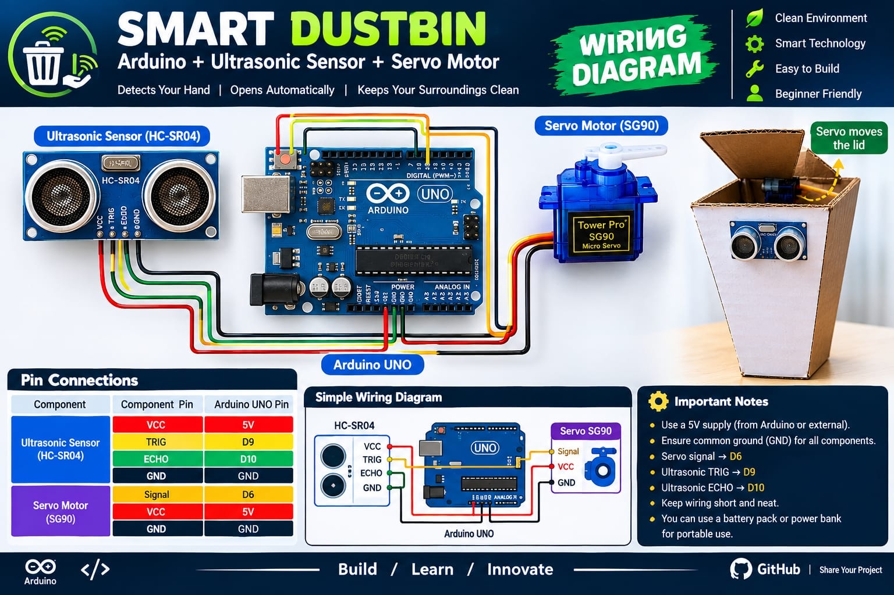

# Connection Diagram



## Pin map

### HC-SR04 ultrasonic sensor

| Sensor pin | Arduino pin | Notes |
|---|---|---|
| VCC | 5V | Needs a full 5V; 3.3V gives unreliable echoes |
| TRIG | 9 | Output from Arduino |
| ECHO | 10 | Input to Arduino |
| GND | GND | Common ground |

### SG90 servo motor

| Wire colour | Arduino pin | Notes |
|---|---|---|
| Orange / yellow | 6 | PWM signal |
| Red | 5V | See the power note below |
| Brown / black | GND | Common ground |

## Text schematic

```
        Arduino Uno
        ┌──────────────┐
        │              │
  5V ───┤              ├─── D9  ──────── TRIG  ┐
 GND ───┤              ├─── D10 ──────── ECHO  ├── HC-SR04
        │              │                       │
        │              │      5V ─────── VCC   │
        │              │     GND ─────── GND   ┘
        │              │
        │              ├─── D6  ──────── Signal ┐
        │              │      5V ─────── VCC    ├── SG90 Servo
        │              │     GND ─────── GND    ┘
        └──────────────┘
```

## Power note

The Uno's onboard 5V regulator can just about run an SG90 that is only lifting a light plastic lid, and that is how the wiring above is drawn. If the lid is heavy, or if you see the Arduino resetting or the sensor reporting nonsense the moment the servo moves, the servo is browning out the board. Fix it by giving the servo its own 5V supply (four AA cells or a 5V 1A adapter) and tying that supply's ground to the Arduino's ground. The signal wire still goes to D6.

## Physical assembly

1. Cut a small window in the front of the bin at roughly hand height and mount the HC-SR04 so both barrels face straight out. Hot glue around the rim, not over the barrels.
2. Mount the servo on the back edge of the bin near the lid hinge, body fixed to the bin wall.
3. Attach a servo horn to the lid — either directly, if the geometry allows, or with a short stiff pushrod made from a paperclip or lollipop stick.
4. Before you glue anything permanently, power the board and confirm the lid reaches a full open position and seats closed. Adjust `openAngle` and `closeAngle` in the sketch, not the mechanism.
5. Tape the Arduino and battery to the outside back of the bin so the bin liner can still be removed.


## Common wiring mistakes

- **TRIG and ECHO swapped.** The Serial Monitor prints `No Echo` forever. Swap pins 9 and 10.
- **Missing common ground** when using a separate servo supply. The servo twitches or ignores commands.
- **Sensor pointed at the floor or into the bin's own rim.** It sees a constant short distance and the lid cycles endlessly.
